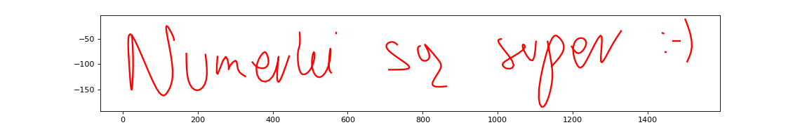

# Cubic Spline Interpolation (NIFS3)

Original image:

Image with points, chosen by the user:

Recreated image:

## program.py

The main part of the script reads data from a file (dane.txt), extracts coordinates for x, y, and u values, performs cubic spline interpolation, and plots the results using Matplotlib.

## points.py

The script allows the user to interactively click points on an image using the left mouse button. Clicking the right mouse button ends a segment, and the coordinates are stored in files (**x_val.txt** and **y_val.txt**). The collected data is then combined into dane.txt for later use in the **program.py** script.

> **(TO FIX)** Sometimes when clicking once/twice in the same spot it causes to stop saving the points from this point

> **(TEMPORARY FIX)** When in need of a single point, pick a point so close to it, that the connection between them appears as a point.

## Combined Usage:
- Run points.py to collect data points interactively. Data points are saved in x_val.txt and y_val.txt.
    - The data saved in **x_val.txt** and **y_val.txt** is later combined into **dane.txt**, where it's ready to be used by program.py.
    - The data in **dane.txt** can also be changed, if different accuracy/efficency is desired. In that case, specific lines have to be correctly adjusted.
- Run **program.py** to perform cubic spline interpolation and visualize the results using Matplotlib.

Any image can be used, provided the path to it is set correctly. Same goes for the data.

The most accurate data was achieved in "**dane.txt**" file (it was manually modified after its creation), other are either less accurate or lacking in other areas.

If a new data file is desired, we can adjust the correct line in **points.py** (by default a new file called "**data_new.txt**" will be created, where data will be stored)

> The provided images and data are just an example of how those can look like. All data in "dane" folder was created using **points.py** script, which used images in "in" folder. 